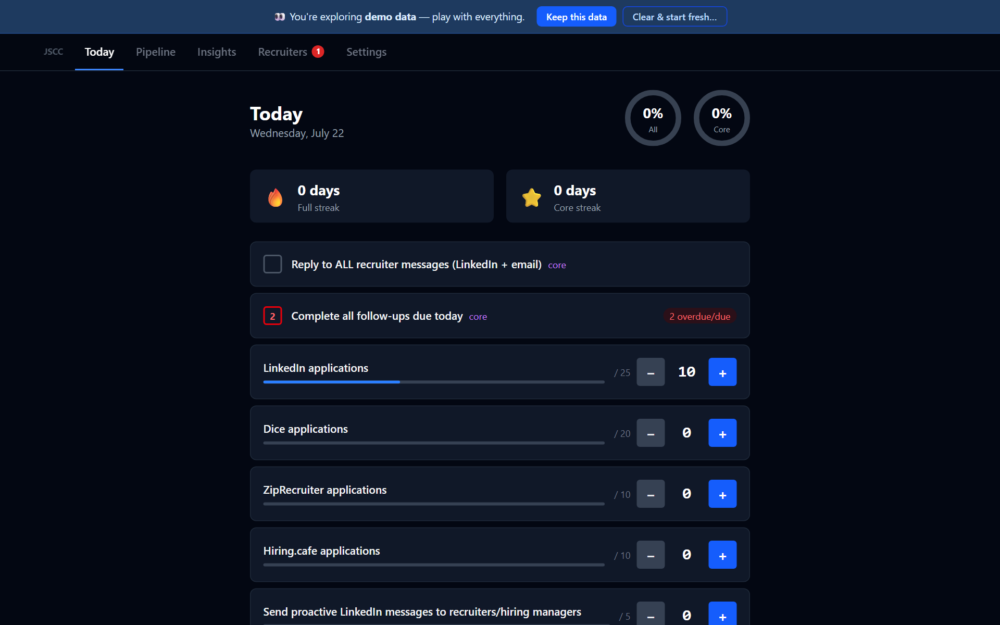
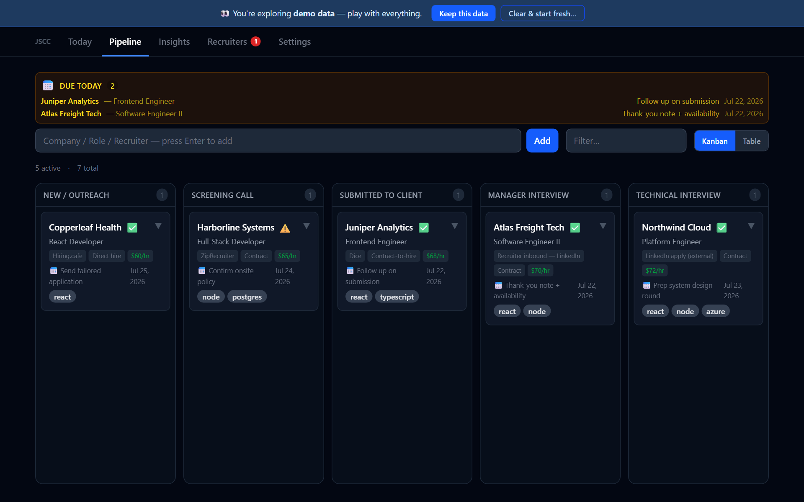
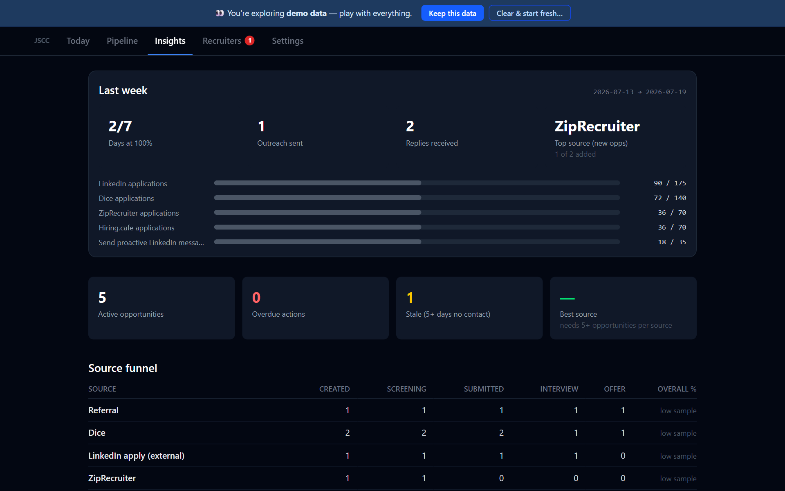

# Job Search Command Center

**A private campaign discipline system for your job search.** Daily targets, streaks, follow-up cadence, and honest weekly retros — all stored in your browser. No account. No server. The app contains no analytics or tracking code.

**[▶ Try the live demo](https://hausery.github.io/job-search-command-center/)** — one click loads example data; nothing you do leaves your browser. Works offline and installs as an app.



## Why this exists

Most job-search trackers are record keepers: they remember your applications. But a job search rarely fails from lost records — it fails from **inconsistent effort**. JSCC is built around the discipline, not the paperwork:

- **Daily targets & streaks** — a checklist with counters (25 LinkedIn apps, 5 outreach messages…), progress rings, and streak counters that reset when you slack. A 26-week heatmap makes your consistency (or your gaps) impossible to ignore.
- **Honest weekly retros** — every Monday, last week is judged against the targets *you had that week* (editing targets never rewrites history), with plain counts of outreach sent and replies received. No vanity ratios.
- **Follow-up discipline** — every opportunity and recruiter carries a next action with a due date; overdue items chase you across the app.
- **A pipeline that ends in outcomes** — drag opportunities from New → Screening → Interviews → Offer, then into **🏆 Won** or **✖ Didn't work out**. The Insights tab tells you which job board actually converts.




## Private by architecture

Your data lives in your browser's localStorage — there is nowhere else it *could* go. The page itself carries no third-party scripts, badges, or fonts. Moving machines or backing up is a first-class flow: **Settings → Export JSON** produces a versioned backup; import it anywhere, losslessly (round-trip is test-enforced). Data safety is engineered, not assumed: corrupted state is quarantined behind a recovery screen (never silently wiped), failed saves raise a visible warning with one-click export, schema versions migrate automatically, and two open windows stay in sync.

## The screening field

Opportunities carry a screening field — shipped as **Halal status**, because this tool was built by a job seeker who screens opportunities by his values, and that field earned its place through daily use. Yours might be visa sponsorship, remote-only, or a salary floor: rename the field and its statuses in Settings, or hide it entirely. The ❌ status guards against accidentally advancing opportunities you've decided to avoid.

## Run it yourself

```bash
git clone https://github.com/HauserY/job-search-command-center.git
cd job-search-command-center
npm install
npm run dev      # → http://localhost:5173
```

`npm test` runs the 137-test Vitest suite; `npm run test:e2e` runs Playwright smoke tests (including offline PWA behavior) against a production build. React 19 + Vite + Tailwind; state is a single reducer persisted through a versioned migration registry.

## Contributing

Issues and PRs welcome — see [CONTRIBUTING.md](CONTRIBUTING.md). The full product/engineering design doc lives at [docs/designs/discipline-first-release.md](docs/designs/discipline-first-release.md).

## License

[MIT](LICENSE)
